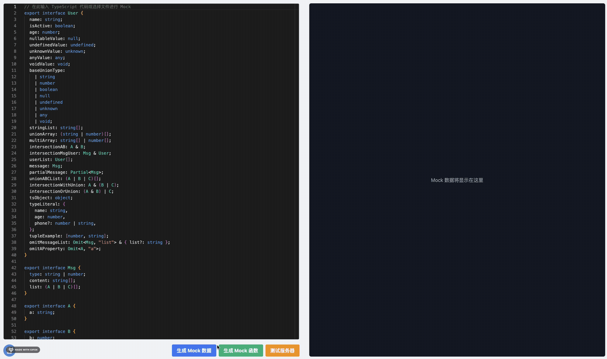

# ts2mock-web

[English](./README.md) | 简体中文

ts2mock-web 是一个 TypeScript 接口解析项目，用于生成 Mock 数据和 Mock 函数。

## 演示



## 功能

- 解析 TypeScript 接口
- 生成 Mock 数据
- 生成 Mock 函数
- 提供客户端界面进行交互
- 支持服务器端处理

## 安装

本项目仅支持使用 pnpm 进行包管理。

1. 确保已安装 pnpm。如果尚未安装，请运行：

```**bash**
npm install -g pnpm
```

2. 克隆项目仓库：

```bash
git clone https://github.com/zzcyes/ts2mock-web.git
cd ts2mock-web
```

2. 安装依赖：
   
```bash
pnpm install
```

## 使用

```bash
pnpm start
```
